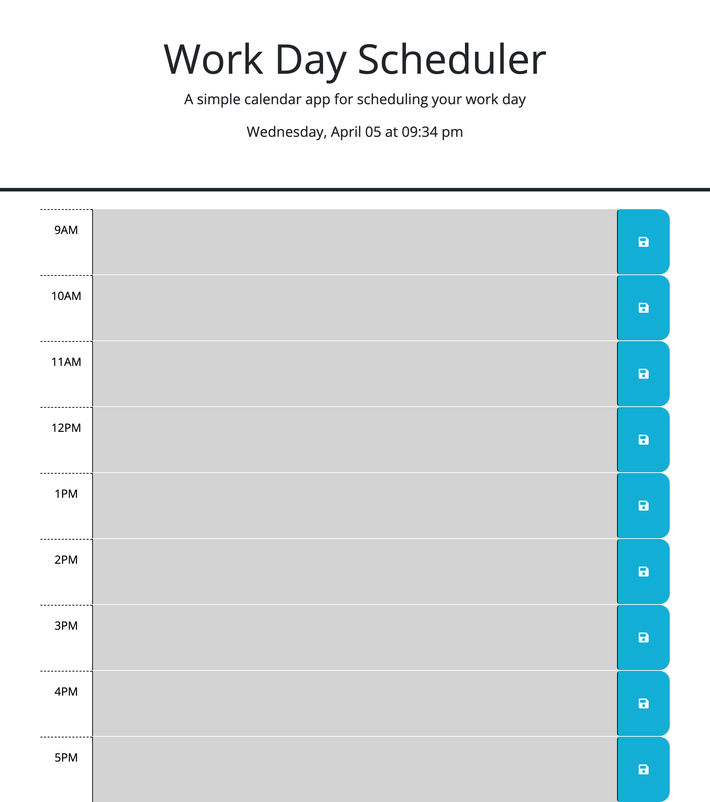

# Scheduling-Your-Work-Day

## Description
Provided with the starter code to the work day scheduler, I added to the HTML files to create the individual sections for the time blocks. I then worked on the JavaScript file to add the features to meet the acceptance criteria. 

When a user opens the this work day scheduler on their google chrome browser, they will be able to see the current date and time at displayed at the top of the calendar. They will be able to scroll down and view the different times in a standard 9am to 5pm work business work day. They will see that the time blocks are color-coded to determine if the time block is in the past, present of future with respect to the current time displayed at the top. The user will be able to enter their events and task for their desired time block and will be able to save the event to their local storage. When they close the work day scheduler and reopen at a later time, they will see that their past inputs will be saved and displayed in the work day scheduler.

## Live URL

## Resources Used on Project
1. Starter Code - https://github.com/coding-boot-camp/crispy-octo-meme
2. jQuery API Documentation - https://api.jquery.com/
4. Local Storage - https://developer.mozilla.org/en-US/docs/Web/API/Window/localStorage

## Contributors
1. caballero-r
2. Georheyoo
3. Tutor - Neil Dhand
4. Tutor - JayTee Padilla